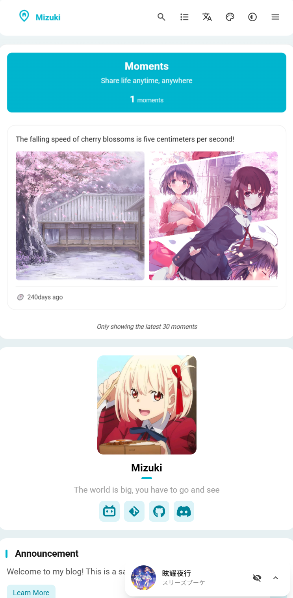

# 🌸 Mizuki  
 
 


[](https://opensource.org/licenses/MIT)


<table>
  <tr>
    <td></td>
    <td></td>
    <td></td>
  <tr>
  <tr>
    <td></td>
    <td></td>
    <td></td>
  <tr>
</table>


A modern, feature-rich static blog template built with [Astro](https://astro.build), featuring advanced functionality and beautiful design.

[**🖥️ Live Demo**](https://mizuki.mysqil.com/)
[**📝 Documentation**](https://docs.mizuki.mysqil.com/)

🌏 README Languages
[**English**](./README.md) /
[**中文**](./README.zh.md) /
[**日本語**](./docs/README.ja.md) /
[**中文繁体**](./docs/README.tw.md) /

## 🆕 v4.9 Update
- **Pio Live2D Integration**: Added Pio Live2D character, providing a cute interactive companion to enhance user engagement.
- **Highly Configurable**: Supports detailed configuration in `src/config.ts`, including model path, position, size, dialogue content, etc., to meet personalized needs.
- **Seamless Navigation**: The "Back to Home" feature now uses the theme's built-in Swup for smooth, no-refresh page transitions.

## 🆕 v4.3 Update
- **Anime Page:** Redesigned a cuter and more attractive anime page, including anime list, details, and timeline.
- **Album Page:** Restructured the album page using pagination + folder data indexing solution.

## 🆕 v3.4 Update
- **New Pages:** Added project showcase, skills showcase, and timeline pages to display your work, professional skills, and growth journey.
- **Dropdown Menu Fix:** Resolved the issue of border outlines appearing when clicking dropdown menus, improving interface consistency.
- **Search Optimization:** Enhanced search functionality performance and accuracy.
- **Footer HTML Injection:** Introduced a new feature allowing custom HTML content injection at the bottom of pages, providing greater flexibility.

## 🆕 v3.3 Update
- **Mermaid Syntax Support:** Added support for Mermaid chart syntax, now you can embed flowcharts, sequence diagrams, Gantt charts, etc. directly in Markdown.
- **Umami Analytics:** Added support for Umami analytics, making it easy to integrate website visit data analysis.


### 🔧 Component Configuration System Restructuring
- **Unified Configuration Architecture:** Brand new modular component configuration system, supporting dynamic component management and order configuration
- **Configuration-Driven Component Loading:** Restructured SideBar component, implementing fully configuration-based component loading mechanism
- **Unified Control Switches:** Removed independent enable switches for music player and announcement components, unified control through sidebarLayoutConfig
- **Responsive Layout Adaptation:** Components support responsive layouts, automatically adjusting display based on device type

### 📐 Layout System Optimization
- **Dynamic Sidebar Position Adjustment:** Support for left/right sidebar switching, with automatic layout adaptation
- **Intelligent Article Directory Positioning:** When sidebar is on the right, article navigation automatically moves to the left, providing a better reading experience
- **Grid Layout Improvements:** Optimized CSS Grid layout, resolving container width anomaly issues

### 🎛️ Configuration File Format Standardization
- **Standardized Configuration Format:** Created unified component configuration file format specifications
- **Type Safety:** Comprehensive TypeScript type definitions ensuring configuration type safety
- **Extensibility:** Support for custom component types and configuration options

### 🧹 Code Optimization
- **Test File Cleanup:** Removed unused test configurations and dependencies, reducing project size
- **Code Structure Optimization:** Improved component architecture, enhancing code maintainability
- **Performance Improvement:** Optimized component loading logic, improving page rendering performance

---

## ✨ Features

### 🎨 Design & Interface
- [x] Built with [Astro](https://astro.build) and [Tailwind CSS](https://tailwindcss.com)
- [x] Smooth animations and page transitions using [Swup](https://swup.js.org/)
- [x] Light/dark theme switching with system preference detection
- [x] Customizable theme colors and dynamic banner carousel
- [x] Fullscreen background images with carousel, opacity, and blur effects
- [x] Fully responsive design for all devices
- [x] Beautiful typography with JetBrains Mono font

### 🔍 Content & Search
- [x] Advanced search functionality based on [Pagefind](https://pagefind.app/)
- [x] [Enhanced Markdown features](#-markdown-extensions) with syntax highlighting
- [x] Interactive table of contents with auto-scrolling
- [x] RSS feed generation
- [x] Reading time estimation
- [x] Article categorization and tagging system

### 🌐 Internationalization
- [x] **Multi-language support** with real-time translation
- [x] **Automatic language detection** based on user preferences
- [x] **Client-side translation** powered by Edge Translate
- [x] Support for 10+ languages (Chinese, English, Japanese, Korean, Spanish, etc.)

### 📱 Special Pages
- [x] **Anime Tracking Page** - Track anime watching progress and ratings
- [x] **Friends Page** - Beautiful cards showcasing friend websites
- [x] **Diary Page** - Share life moments, similar to social media
- [x] **Archive Page** - Organized timeline view of articles
- [x] **About Page** - Customizable personal introduction

### 🛠 Technical Features
- [x] **Enhanced code blocks** based on [Expressive Code](https://expressive-code.com/)
- [x] **Math formula support** with KaTeX rendering
- [x] **Image optimization** with PhotoSwipe gallery integration
- [x] **SEO optimization** including sitemaps and meta tags
- [x] **Performance optimization** with lazy loading and caching
- [x] **Comment system** with Twikoo integration

## 🚀 Quick Start

### 📦 Installation

1. **Clone the repository:**
   ```bash
   git clone https://github.com/matsuzaka-yuki/mizuki.git
   cd mizuki
   ```

2. **Install dependencies:**
   ```bash
   # Install pnpm if not already installed
   npm install -g pnpm
   
   # Install project dependencies
   pnpm install
   ```

3. **Configure your blog:**
   - Edit `src/config.ts` to customize blog settings
   - Update site information, theme colors, banner images, and social links
   - Configure translation settings and feature page functionality

4. **Start the development server:**
   ```bash
   pnpm dev
   ```
   Your blog will be available at `http://localhost:4321`

### 📝 Content Management

- **Create new posts:** `pnpm new-post <filename>`
- **Edit posts:** Modify files in `src/content/posts/`
- **Customize special pages:** Edit files in `src/content/spec/`
- **Add images:** Place images in `src/assets/` or `public/`

### 🚀 Deployment

Deploy your blog to any static hosting platform:

- **Vercel:** Connect your GitHub repository to Vercel
- **Netlify:** Deploy directly from GitHub
- **GitHub Pages:** Use the included GitHub Actions workflow
- **Cloudflare Pages:** Connect your repository

Before deployment, update the `site` URL in `astro.config.mjs`.

## 📝 Post Frontmatter Format

```yaml
---
title: My First Blog Post
published: 2023-09-09
description: This is the first post of my new blog.
image: ./cover.jpg
tags: [tag1, tag2]
category: Frontend
draft: false
pinned: false
lang: en      # Only set when article language differs from site language in config.ts
---
```

### Frontmatter Field Descriptions

- **title**: Article title (required)
- **published**: Publication date (required)
- **description**: Article description for SEO and previews
- **image**: Cover image path (relative to article file)
- **tags**: Array of tags for categorization
- **category**: Article category
- **draft**: Set to `true` to hide article in production
- **pinned**: Set to `true` to pin article to top
- **lang**: Article language (only set when different from site default)

### Pinned Articles Feature

The `pinned` field allows you to pin important articles to the top of your blog list. Pinned articles will always appear before regular articles regardless of their publication date.

**Usage:**
```yaml
pinned: true  # Pin this article to the top
pinned: false # Regular article (default)
```

**Sorting Rules:**
1. Pinned articles appear first, sorted by publication date (newest first)
2. Regular articles follow, sorted by publication date (newest first)

## 🧩 Markdown Extensions

Mizuki supports enhanced features beyond standard GitHub Flavored Markdown:

### 📝 Enhanced Writing
- **Callouts:** Create beautiful annotation boxes using `> [!NOTE]`, `> [!TIP]`, `> [!WARNING]`, etc.
- **Math Formulas:** Write LaTeX math formulas using `$inline$` and `$$block$$` syntax
- **Code Highlighting:** Advanced syntax highlighting with line numbers and copy buttons
- **GitHub Cards:** Embed repository cards using `::github{repo="user/repo"}`

### 🎨 Visual Elements
- **Image Gallery:** Automatic PhotoSwipe integration for image viewing
- **Collapsible Sections:** Create expandable content blocks
- **Custom Components:** Enhance content with special directives

### 📊 Content Organization
- **Table of Contents:** Automatically generated from headings with smooth scrolling
- **Reading Time:** Automatically calculated and displayed
- **Article Metadata:** Rich frontmatter support with categories and tags

## ⚡ Commands

All commands are run from the project root:

| Command                    | Action                                   |
|:---------------------------|:-----------------------------------------|
| `pnpm install`             | Install dependencies                     |
| `pnpm dev`                 | Start local dev server at `localhost:4321` |
| `pnpm build`               | Build production site to `./dist/`       |
| `pnpm preview`             | Preview build locally before deployment  |
| `pnpm check`               | Run Astro error checking                 |
| `pnpm format`              | Format code with Biome                   |
| `pnpm lint`                | Check and fix code issues                |
| `pnpm new-post <filename>` | Create a new blog post                   |
| `pnpm astro ...`           | Run Astro CLI commands                   |

## 🎯 Configuration Guide

### 🔧 Basic Configuration

Edit `src/config.ts` to customize your blog:

```typescript
export const siteConfig: SiteConfig = {
  title: "Your Blog Name",
  subtitle: "Your Blog Description",
  lang: "en", // or "zh-CN", "ja", etc.
  themeColor: {
    hue: 210, // 0-360, theme hue
    fixed: false, // Hide theme color picker
  },
  translate: {
    enable: true, // Enable translation
    service: "client.edge", // Translation service
    defaultLanguage: "english",
  },
  banner: {
    enable: true,
    src: ["assets/banner/1.webp"], // Banner images
    carousel: {
      enable: true,
      interval: 0.8, // seconds
    },
  },
};
```

### 📱 Feature Page Configuration

- **Anime Page:** Edit anime list in `src/pages/anime.astro`
- **Friends Page:** Edit friend data in `src/content/spec/friends.md`
- **Diary Page:** Edit moments in `src/pages/diary.astro`
- **About Page:** Edit content in `src/content/spec/about.md`

## ✏️ Contributing

Contributions are welcome! Feel free to submit issues and pull requests.

1. Fork the repository
2. Create a feature branch (`git checkout -b feature/amazing-feature`)
3. Commit your changes (`git commit -m 'Add some amazing feature'`)
4. Push to the branch (`git push origin feature/amazing-feature`)
5. Open a Pull Request

## 📄 License

This project is licensed under the MIT License - see the [LICENSE](LICENSE) file for details.

## 🙏 Acknowledgements

- Based on the original [Fuwari](https://github.com/saicaca/fuwari) template
- Built with [Astro](https://astro.build) and [Tailwind CSS](https://tailwindcss.com)
- Inspired by [Yukina](https://github.com/WhitePaper233/yukina) - a beautiful and elegant blog template
- Translation functionality powered by [translate](https://gitee.com/mail_osc/translate) - AI i18n automatic HTML translation solution
- Icons from [Iconify](https://iconify.design/)

### Special Thanks

- **[Yukina](https://github.com/WhitePaper233/yukina)** - Thanks for providing design inspiration and creativity that helped shape this project. Yukina is an elegant blog template that demonstrates excellent design principles and user experience.
- **[translate](https://gitee.com/mail_osc/translate)** - Thanks for providing an innovative AI-driven i18n solution that enables automatic HTML translation with just two lines of JavaScript code. This open-source tool makes multilingual support extremely simple and efficient.

---

⭐ If you find this project helpful, please consider giving it a star!