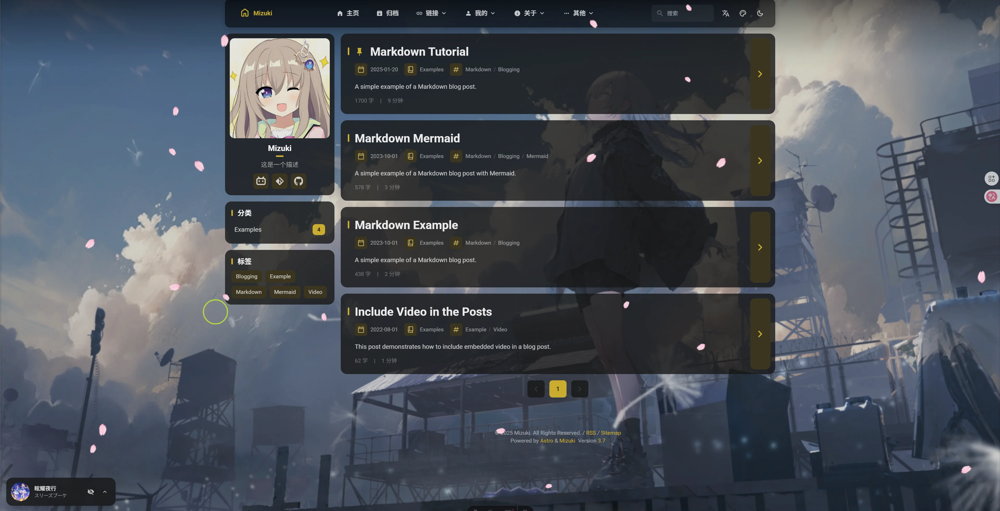

# 🌸 Mizuki  
 
 


[](https://opensource.org/licenses/MIT)


[Astro](https://astro.build)で構築された、高度な機能と美しいデザインを備えたモダンで機能豊富な静的ブログテンプレートです。

[**🖥️ ライブデモ**](https://mizuki.mysqil.com/)
[**📖 ユーザーガイド**](https://docs.mizuki.mysqil.com/)

🌏 README言語
[**中文**](../README.md) /
[**English**](../README.en.md) /
[**日本語**](./README.ja.md)

## 🆕 v4.0の新機能
- **フルスクリーン背景画像機能:** 非バナーモードでのフルスクリーン背景画像サポートを追加し、没入感のあるビジュアル体験を提供。カルーセル切り替え、透明度調整、ぼかし効果設定をサポート。
- **リソースパス最適化:** バナーモードとフルスクリーン背景モードでの画像リソース読み込み問題を修正し、パブリックディレクトリからのリソース正規読み込みを確保。
- **ナビゲーションバー透過効果:** フルスクリーン背景モードでの半透明角丸ナビゲーションバー効果を最適化し、ビジュアル一貫性を向上。
- **モバイルバナー最適化:** 外部リンク呼び出しをサポート



## 🆕 v3.4の新機能
- **新しいページ:** プロジェクト表示 (Projects)、スキル表示 (Skills)、タイムライン (Timeline) の各ページが追加され、個人のプレゼンテーションコンテンツが充実しました。
- **サブメニューのバグ修正:** トップナビゲーションバーのサブメニューでクリック時に枠線が表示されるバグが修正され、ユーザーエクスペリエンスが最適化されました。
- **検索機能の最適化:** 検索機能の既知の問題が解決され、検索の精度と使いやすさが向上しました。
- **フッターHTML挿入:** 新しいフッターHTML挿入機能が追加され、ユーザーがフッターコンテンツをカスタマイズできるようになりました。

## 🆕 v3.3の新機能
- **Mermaid構文のサポート：** Mermaid図の構文サポートを追加し、フローチャート、シーケンス図、ガントチャートなどをMarkdownに直接埋め込むことができます。
- **Umamiアクセス統計：** Umamiアクセス統計のサポートを追加し、ウェブサイトのトラフィックデータ分析を簡単に統合できるようにしました。


### 🔧 コンポーネント設定システムリファクタリング
- **統一設定アーキテクチャ：** 動的コンポーネント管理と順序設定をサポートする全く新しいモジュラーコンポーネント設定システム
- **設定駆動型コンポーネント読み込み：** SideBarコンポーネントをリファクタリングし、完全に設定ベースのコンポーネント読み込みメカニズムを実装
- **統一制御スイッチ：** 音楽プレーヤーとアナウンスコンポーネントの独立したenableスイッチを削除し、sidebarLayoutConfigによる統一制御
- **レスポンシブレイアウト適応：** コンポーネントがレスポンシブレイアウトをサポートし、デバイスタイプに基づいて自動的に表示を調整

### 📐 レイアウトシステム最適化
- **サイドバー位置の動的調整：** 左右サイドバーの切り替えをサポートし、レイアウトが自動適応
- **記事ナビゲーションのスマート配置：** サイドバーが右側にある場合、記事ナビゲーションが自動的に左側に移動し、より良い読書体験を提供
- **グリッドレイアウト改善：** CSS Gridレイアウトを最適化し、コンテナ幅の異常問題を解決

### 🎛️ 設定ファイル形式標準
- **標準化された設定形式：** 統一されたコンポーネント設定ファイル形式仕様を作成
- **型安全性：** 包括的なTypeScript型定義により、設定の型安全性を確保
- **拡張性：** カスタムコンポーネントタイプと設定オプションをサポート

### 🧹 コード最適化
- **テストファイルクリーンアップ：** 未使用のテスト設定と依存関係を削除し、プロジェクトサイズを削減
- **コード構造最適化：** コンポーネントアーキテクチャを改善し、コードの保守性を向上
- **パフォーマンス向上：** コンポーネント読み込みロジックを最適化し、ページレンダリングパフォーマンスを向上

---

## ✨ 機能

### 🎨 デザイン & UI
- [x] [Astro](https://astro.build)と[Tailwind CSS](https://tailwindcss.com)で構築
- [x] [Swup](https://swup.js.org/)によるスムーズなアニメーションとページ遷移
- [x] システム設定検出付きライト/ダークモード
- [x] カスタマイズ可能なテーマカラーと動的バナーカルーセル
- [x] カルーセル、透明度、ぼかし効果付きフルスクリーン背景画像
- [x] 全デバイス対応の完全レスポンシブデザイン
- [x] JetBrains Monoフォントによる美しいタイポグラフィ

### 🔍 コンテンツ & 検索
- [x] [Pagefind](https://pagefind.app/)による高度な検索機能
- [x] シンタックスハイライト付き[拡張Markdown機能](#-markdown拡張構文)
- [x] 自動スクロール付きインタラクティブ目次
- [x] RSSフィード生成
- [x] 読了時間推定
- [x] 投稿のカテゴリ分けとタグ付け

### 🌐 国際化
- [x] **多言語サポート**とリアルタイム翻訳
- [x] ユーザー設定に基づく**自動言語検出**
- [x] Edge Translateによる**クライアントサイド翻訳**
- [x] 10以上の言語サポート（EN、ZH-CN、ZH-TW、JA、KO、ES、TH、VI、ID、TR）

### 📱 特別ページ
- [x] **アニメ追跡ページ** - 評価付きでアニメ視聴進捗を追跡
- [x] **友達リンクページ** - 美しいカードで友達のウェブサイトを紹介
- [x] **日記/モーメントページ** - ソーシャルメディア投稿のように生活の瞬間を共有
- [x] **アーカイブページ** - 整理された投稿タイムライン表示
- [x] **アバウトページ** - カスタマイズ可能な自己紹介

### 🛠 技術機能
- [x] [Expressive Code](https://expressive-code.com/)による**拡張コードブロック**
- [x] KaTeXレンダリングによる**数式サポート**
- [x] PhotoSwipeギャラリーによる**画像最適化**
- [x] サイトマップとメタタグによる**SEO最適化**
- [x] 遅延読み込みとキャッシュによる**パフォーマンス最適化**
- [x] **コメントシステム**統合対応（Twikoo）

## 🚀 はじめに

### 📦 インストール

1. **リポジトリをクローン:**
   ```bash
   git clone https://github.com/matsuzaka-yuki/mizuki.git
   cd mizuki
   ```

2. **依存関係をインストール:**
   ```bash
   # pnpmをインストール（未インストールの場合）
   npm install -g pnpm
   
   # プロジェクトの依存関係をインストール
   pnpm install
   ```

3. **ブログを設定:**
   - `src/config.ts`を編集してブログ設定をカスタマイズ
   - サイト情報、テーマカラー、バナー画像、ソーシャルリンクを更新
   - 翻訳設定と特別ページ機能を設定

4. **開発サーバーを起動:**
   ```bash
   pnpm dev
   ```
   ブログは`http://localhost:4321`で利用可能になります

### 📝 コンテンツ管理

- **新しい投稿を作成:** `pnpm new-post <ファイル名>`
- **投稿を編集:** `src/content/posts/`内のファイルを変更
- **ページをカスタマイズ:** `src/content/spec/`内の特別ページを編集
- **画像を追加:** `src/assets/`または`public/`に画像を配置

### 🚀 デプロイ

任意の静的ホスティングプラットフォームにブログをデプロイ:

- **Vercel:** GitHubリポジトリをVercelに接続
- **Netlify:** GitHubから直接デプロイ
- **GitHub Pages:** 含まれているGitHub Actionsワークフローを使用
- **Cloudflare Pages:** リポジトリを接続

デプロイ前に、`astro.config.mjs`の`site` URLを更新してください。

## 📝 投稿フロントマター

```yaml
---
title: 私の最初のブログ投稿
published: 2023-09-09
description: これは私の新しいAstroブログの最初の投稿です。
image: ./cover.jpg
tags: [Foo, Bar]
category: フロントエンド
draft: false
pinned: false
---
```

### フロントマターフィールド

- **title**: 投稿タイトル（必須）
- **published**: 公開日（必須）
- **description**: SEOとプレビュー用の投稿説明
- **image**: カバー画像パス（投稿ファイルからの相対パス）
- **tags**: カテゴリ分け用のタグ配列
- **category**: 投稿カテゴリ
- **draft**: 本番環境で投稿を非表示にするには`true`に設定
- **pinned**: 投稿をリストの上部に固定するには`true`に設定

### 固定投稿

`pinned`フィールドを使用すると、重要な投稿をブログの上部に固定できます。固定投稿は公開日に関係なく、常に通常の投稿より前に表示されます。

**使用方法:**
```yaml
pinned: true  # この投稿を上部に固定
pinned: false # 通常の投稿（デフォルト）
```

**ソート動作:**
1. 固定投稿が最初に表示され、公開日順（新しい順）でソート
2. 通常の投稿が続き、公開日順（新しい順）でソート

## 🧩 Markdown拡張構文

Mizukiは標準のGitHub Flavored Markdownを超えた拡張Markdown機能をサポートしています:

### 📝 拡張ライティング
- **注意書き:** `> [!NOTE]`、`> [!TIP]`、`> [!WARNING]`などで美しいコールアウトボックスを作成
- **数式:** `$インライン$`と`$$ブロック$$`構文でLaTeX数式を記述
- **コードハイライト:** 行番号とコピーボタン付きの高度なシンタックスハイライト
- **GitHubカード:** `::github{repo="ユーザー/リポジトリ"}`でリポジトリカードを埋め込み

### 🎨 視覚要素
- **画像ギャラリー:** 画像表示用の自動PhotoSwipe統合
- **折りたたみセクション:** 展開可能なコンテンツブロックを作成
- **カスタムコンポーネント:** 拡張コンテンツ用の特別なディレクティブを使用

### 📊 コンテンツ整理
- **目次:** 見出しから自動生成、スムーズスクロール付き
- **読了時間:** 自動計算と表示
- **投稿メタデータ:** カテゴリとタグ付きの豊富なフロントマターサポート

## ⚡ コマンド

すべてのコマンドはプロジェクトのルートから実行します:

| コマンド                    | アクション                                          |
|:---------------------------|:---------------------------------------------------|
| `pnpm install`             | 依存関係をインストール                              |
| `pnpm dev`                 | `localhost:4321`でローカル開発サーバーを起動        |
| `pnpm build`               | `./dist/`に本番サイトをビルド                       |
| `pnpm preview`             | デプロイ前にローカルでビルドをプレビュー             |
| `pnpm check`               | エラーのAstroチェックを実行                         |
| `pnpm format`              | Biomeを使用してコードをフォーマット                 |
| `pnpm lint`                | コードの問題をリントして修正                        |
| `pnpm new-post <ファイル名>` | 新しいブログ投稿を作成                             |
| `pnpm astro ...`           | Astro CLIコマンドを実行                            |

## 📄 ライセンス

このプロジェクトはMITライセンスの下でライセンスされています - 詳細は[LICENSE](../LICENSE)ファイルを参照してください。

## 🙏 謝辞

- オリジナルの[Fuwari](https://github.com/saicaca/fuwari)テンプレートをベースに
- [Astro](https://astro.build)と[Tailwind CSS](https://tailwindcss.com)で構築
- [Yukina](https://github.com/WhitePaper233/yukina)からインスピレーション - 美しくエレガントなブログテンプレート
- 翻訳機能は[translate](https://gitee.com/mail_osc/translate)により提供 - AI i18n 自動HTML翻訳ソリューション
- [Iconify](https://iconify.design/)のアイコン

### 特別な感謝

- **[Yukina](https://github.com/WhitePaper233/yukina)** - このプロジェクトの形成に役立つデザインのインスピレーションとアイデアを提供してくれてありがとうございます。Yukinaは優れたデザイン原則とユーザーエクスペリエンスを実証するエレガントなブログテンプレートです。
- **[translate](https://gitee.com/mail_osc/translate)** - わずか2行のJavaScriptで自動HTML翻訳を可能にする革新的なAI駆動i18nソリューションを提供してくれてありがとうございます。このオープンソースツールにより、多言語サポートが非常にシンプルで効率的になります。

---

⭐ このプロジェクトが役に立つと思ったら、スターを付けることを検討してください！