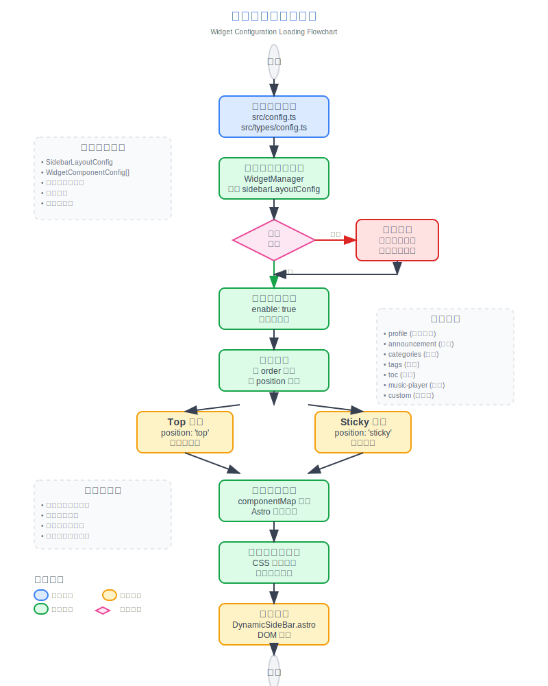

# 🌸 Mizuki  
 
 


[](https://opensource.org/licenses/MIT)


<table>
  <tr>
    <td></td>
    <td></td>
    <td></td>
  <tr>
  <tr>
    <td></td>
    <td></td>
    <td></td>
  <tr>
</table>

[Astro](https://astro.build)をベースにした、先進的な機能と美しいデザインを備えた現代的な静的ブログテンプレートです。

[**🖥️ ライブデモ**](https://mizuki.mysqil.com/)
[**📝 ドキュメント**](https://docs.mizuki.mysqil.com/)

🌏 README 言語
[**English**](../README.md) /
[**中文**](../README.zh.md) /
[**日本語**](./README.ja.md) /
[**中文繁体**](./README.tw.md) /

## 🆕 v5.0 アップデート
- **Pio Live2D統合**: Pio Live2Dキャラクターを統合し、可愛らしいインタラクティブな仲間を提供してユーザーエンゲージメントを向上させます。
- **高度な設定**: モデルパス、位置、サイズ、会話内容など、`src/config.ts`で詳細な設定をサポートし、パーソナライズされたニーズに対応します。
- **シームレスなナビゲーション**: 「ホームに戻る」機能は、テーマに組み込まれたSwupを使用して、スムーズでリフレッシュなしのページ遷移を提供します。

## 🆕 v4.3 アップデート
- **アニメページ：** より可愛くて魅力的なアニメページにリデザインし、アニメリスト、詳細、タイムラインを含みます。
- **アルバムページ：** ページネーション+フォルダデータインデックス方式を使用してアルバムページを再構築しました。

## 🆕 v3.4 アップデート
- **新しいページ：** プロジェクト紹介、スキル紹介、タイムラインページを追加し、あなたの作品、専門スキル、成長の旅を表示できるようになりました。
- **ドロップダウンメニュー修正：** ドロップダウンメニューをクリックした際に表示される境界線の問題を解決し、インターフェースの一貫性を向上させました。
- **検索機能の最適化：** 検索機能のパフォーマンスと精度を向上させました。
- **フッターHTMLインジェクション：** ページの下部にカスタムHTMLコンテンツを挿入できる新機能を導入し、より大きな柔軟性を提供します。

## 🆕 v3.3 アップデート
- **Mermaid構文サポート：** Mermaidチャート構文のサポートを追加し、フローチャート、シーケンス図、ガントチャートなどをMarkdown内に直接埋め込むことができるようになりました。
- **Umamiアナリティクス：** Umamiアナリティクスのサポートを追加し、ウェブサイトの訪問データ分析を簡単に統合できるようになりました。



### 🔧 コンポーネント設定システムの再構築
- **統一された設定アーキテクチャ：** 動的コンポーネント管理と順序設定をサポートする全く新しいモジュラーコンポーネント設定システム
- **設定駆動のコンポーネントローディング：** SideBarコンポーネントを再構築し、完全に設定ベースのコンポーネントローディングメカニズムを実装
- **統一制御スイッチ：** 音楽プレーヤーとお知らせコンポーネントの独立したenableスイッチを削除し、sidebarLayoutConfigによる統一制御に
- **レスポンシブレイアウト適応：** コンポーネントがレスポンシブレイアウトをサポートし、デバイスタイプに基づいて表示を自動調整

### 📐 レイアウトシステムの最適化
### 🎛️ 設定ファイル形式の標準化
 - **Umami API キー（任意）：** Umami アナリティクスを使用する場合は、デプロイ先プラットフォームに環境変数 `UMAMI_API_KEY` を設定するか、プロジェクトの設定ファイルに直接キーを記載することを推奨します。
- **型安全性：** 設定の型安全性を確保する包括的なTypeScript型定義
- **拡張性：** カスタムコンポーネントタイプと設定オプションのサポート

### 🧹 コード最適化
- **テストファイルのクリーンアップ：** 未使用のテスト設定と依存関係を削除し、プロジェクトサイズを削減
- **コード構造の最適化：** コンポーネントアーキテクチャを改善し、コードの保守性を向上
- **パフォーマンス向上：** コンポーネントローディングロジックを最適化し、ページレンダリングパフォーマンスを向上

---

## ✨ 機能

### 🎨 デザインとインターフェース
- [x] [Astro](https://astro.build)と[Tailwind CSS](https://tailwindcss.com)で構築
- [x] [Swup](https://swup.js.org/)を使用したスムーズなアニメーションとページ遷移
- [x] システム設定検出機能付きのライト/ダークテーマ切り替え
- [x] カスタマイズ可能なテーマカラーと動的バナーカルーセル
- [x] カルーセル、透明度、ぼかし効果を備えた全画面背景画像
- [x] すべてのデバイスに対応した完全レスポンシブデザイン
- [x] JetBrains Monoフォントによる美しいタイポグラフィ

### 🔍 コンテンツと検索
- [x] [Pagefind](https://pagefind.app/)ベースの高度な検索機能
- [x] 構文強調表示付きの[拡張Markdown機能](#-markdown拡張機能)
- [x] 自動スクロール機能付きのインタラクティブな目次
- [x] RSSフィード生成
- [x] 読書時間の推定
- [x] 記事のカテゴリ化とタグシステム


### 📱 特別ページ
- [x] **アニメトラッキングページ** - アニメの視聴進捗と評価を追跡
- [x] **友達ページ** - 友達のウェブサイトを美しいカードで紹介
- [x] **日記ページ** - ソーシャルメディアのような生活の瞬間を共有
- [x] **アーカイブページ** - 記事の整理されたタイムラインビュー
- [x] **アバウトページ** - カスタマイズ可能な自己紹介

### 🛠 技術的特徴
- [x] [Expressive Code](https://expressive-code.com/)ベースの**拡張コードブロック**
- [x] KaTeXレンダリングによる**数式サポート**
- [x] PhotoSwipeギャラリー統合による**画像最適化**
- [x] サイトマップとメタタグを含む**SEO最適化**
- [x] 遅延読み込みとキャッシュによる**パフォーマンス最適化**
- [x] Twikoo統合による**コメントシステム**

## 🚀 クイックスタート

### 📦 インストール

1. **リポジトリをクローン：**
   ```bash
   git clone https://github.com/matsuzaka-yuki/mizuki.git
   cd mizuki
   ```

2. **依存関係をインストール：**
   ```bash
   # pnpmがインストールされていない場合はインストール
   npm install -g pnpm
   
   # プロジェクトの依存関係をインストール
   pnpm install
   ```

3. **ブログを設定：**
   - `src/config.ts`を編集してブログ設定をカスタマイズ
   - サイト情報、テーマカラー、バナー画像、ソーシャルリンクを更新
   - 機能ページの機能を設定

4. **開発サーバーを起動：**
   ```bash
   pnpm dev
   ```
   ブログは`http://localhost:4321`で利用可能になります

### 📝 コンテンツ管理

- **新しい投稿を作成：** `pnpm new-post <ファイル名>`
- **投稿を編集：** `src/content/posts/`内のファイルを修正
- **特別ページをカスタマイズ：** `src/content/spec/`内のファイルを編集
- **画像を追加：** 画像を`src/assets/`または`public/`に配置

### 🚀 デプロイ

ブログを任意の静的ホスティングプラットフォームにデプロイ：

- **Vercel：** GitHubリポジトリをVercelに接続
- **Netlify：** GitHubから直接デプロイ
- **GitHub Pages：** 付属のGitHub Actionsワークフローを使用
- **Cloudflare Pages：** リポジトリを接続

デプロイ前に、`astro.config.mjs`の`site` URLを更新してください。

## 📝 投稿フロントマター形式

```yaml
---
title: 私の最初のブログ投稿
published: 2023-09-09
description: これは私の新しいブログの最初の投稿です。
image: ./cover.jpg
tags: [タグ1, タグ2]
category: フロントエンド
draft: false
pinned: false
lang: ja      # 記事の言語がconfig.tsのサイト言語と異なる場合のみ設定
---
```

### フロントマターフィールドの説明

- **title**: 記事のタイトル（必須）
- **published**: 公開日（必須）
- **description**: SEOとプレビュー用の記事の説明
- **image**: カバー画像のパス（記事ファイルからの相対パス）
- **tags**: カテゴリ化のためのタグの配列
- **category**: 記事のカテゴリ
- **draft**: 本番環境で記事を非表示にするには`true`に設定
- **pinned**: 記事を上部に固定するには`true`に設定
- **lang**: 記事の言語（サイトのデフォルト言語と異なる場合のみ設定）

### ピン留め記事機能

`pinned`フィールドを使用すると、重要な記事をブログリストの上部に固定できます。ピン留めされた記事は、公開日に関係なく、常に通常の記事の前に表示されます。

**使用方法：**
```yaml
pinned: true  # この記事を上部に固定
pinned: false # 通常の記事（デフォルト）
```

**ソートルール：**
1. ピン留め記事が最初に表示され、公開日でソート（最新が先）
2. 通常の記事がその後に表示され、公開日でソート（最新が先）

## 🧩 Markdown拡張機能

Mizukiは標準のGitHub Flavored Markdownを超える拡張機能をサポートしています：

### 📝 拡張ライティング
- **コールアウト：** `> [!NOTE]`、`> [!TIP]`、`> [!WARNING]`などを使用して美しい注釈ボックスを作成
- **数式：** `$インライン$`と`$$ブロック$$`構文を使用してLaTeX数式を記述
- **コード強調表示：** 行番号とコピーボタン付きの高度な構文強調表示
- **GitHubカード：** `::github{repo="ユーザー/リポジトリ"}`を使用してリポジトリカードを埋め込み

### 🎨 ビジュアル要素
- **画像ギャラリー：** 画像表示のための自動PhotoSwipe統合
- **折りたたみセクション：** 展開可能なコンテンツブロックを作成
- **カスタムコンポーネント：** 特別なディレクティブでコンテンツを強化

### 📊 コンテンツ整理
- **目次：** 見出しから自動生成され、スムーズスクロールをサポート
- **読書時間：** 自動計算して表示
- **記事メタデータ：** カテゴリとタグを含む豊富なフロントマターサポート

## ⚡ コマンド

すべてのコマンドはプロジェクトルートから実行します：

| コマンド                    | アクション                                |
|:---------------------------|:----------------------------------------|
| `pnpm install`             | 依存関係をインストール                     |
| `pnpm dev`                 | `localhost:4321`でローカル開発サーバーを起動 |
| `pnpm build`               | 本番サイトを`./dist/`にビルド              |
| `pnpm preview`             | デプロイ前にビルドをローカルでプレビュー     |
| `pnpm check`               | Astroエラーチェックを実行                  |
| `pnpm format`              | Biomeでコードをフォーマット                |
| `pnpm lint`                | コードの問題をチェックして修正              |
| `pnpm new-post <ファイル名>` | 新しいブログ投稿を作成                     |
| `pnpm astro ...`           | Astro CLIコマンドを実行                   |

## 🎯 設定ガイド

### 🔧 基本設定

`src/config.ts`を編集してブログをカスタマイズ：

```typescript
export const siteConfig: SiteConfig = {
  title: "あなたのブログ名",
  subtitle: "あなたのブログの説明",
  lang: "ja", // または "zh-CN"、"en" など
  themeColor: {
    hue: 210, // 0-360、テーマの色相
    fixed: false, // テーマカラーピッカーを非表示
  },
  banner: {
    enable: true,
    src: ["assets/banner/1.webp"], // バナー画像
    carousel: {
      enable: true,
      interval: 0.8, // 秒
    },
  },
};
```

### 📱 機能ページの設定

- **アニメページ：** `src/pages/anime.astro`でアニメリストを編集
- **友達ページ：** `src/content/spec/friends.md`で友達データを編集
- **日記ページ：** `src/pages/diary.astro`で瞬間を編集
- **アバウトページ：** `src/content/spec/about.md`でコンテンツを編集

## ✏️ 貢献

貢献は歓迎します！お気軽に問題やプルリクエストを提出してください。

1. リポジトリをフォーク
2. 機能ブランチを作成 (`git checkout -b feature/amazing-feature`)
3. 変更をコミット (`git commit -m 'Add some amazing feature'`)
4. ブランチにプッシュ (`git push origin feature/amazing-feature`)
5. プルリクエストを開く

## 📄 ライセンス

このプロジェクトはMITライセンスの下でライセンスされています - 詳細は[LICENSE](../LICENSE)ファイルをご覧ください。

## 🙏 謝辞

- オリジナルの[Fuwari](https://github.com/saicaca/fuwari)テンプレートをベースにしています
- [Astro](https://astro.build)と[Tailwind CSS](https://tailwindcss.com)で構築
- [Yukina](https://github.com/WhitePaper233/yukina) - 美しくエレガントなブログテンプレートにインスパイアされました
- アイコンは[Iconify](https://iconify.design/)から

### 特別な感謝

- **[Yukina](https://github.com/WhitePaper233/yukina)** - このプロジェクトの形成に役立ったデザインのインスピレーションと創造性を提供してくれたことに感謝します。Yukinaは優れたデザイン原則とユーザーエクスペリエンスを示す、エレガントなブログテンプレートです。

---

⭐ このプロジェクトが役立つと思ったら、スターを付けることを検討してください！