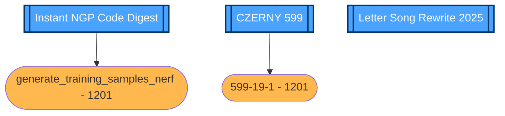

# Month Task Plan

1. [ ] Complete "Instant NGP Code Digest - A First Principle Perspective" Series
2. [ ] Complete CZERNY 599 19-26 / Hanon 1-5, with records.
3. [ ] Complete "Letter Song Rewrite 2025"

# Daily Progress Report

| Sun | Mon | Tue | Wed                                                  | Thu | Fri | Sat |
|-----|-----|-----|------------------------------------------------------|-----|-----|-----|
|     | 1   | 2   | 3 [MEETING(Canceled)] | 4   | 5   | 6   |
| 7   | 8   | 9   | 10 [MEETING]        | 11  | 12  | 13  |
| 14  | 15  | 16  | 17 [REPORT]           | 18  | 19  | 20  |
| 21  | 22  | 23  | 24                                                   | 25  | 26  | 27  |
| 28  | 29  | 30  | 31                                                   |     |     |     |

| Date       | Schedule (ongoing improvements)                                                                                       | Done (completed items)✔️/❌   | Notes / Thoughts (attempts, difficulties, ideas)            |
|------------|-----------------------------------------------------------------------------------------------------------------------|------------------------------|-------------------------------------------------------------|
| 2025-12-01 | 1. 599-19-1   2. iNGP `generate_training_samples_nerf`   3. iNGP `compute_loss_kernel_train_nerf`             | 1. ️✔️   2. ❌   3. ❌ | 1. Kawai CN 29 can not directly record audio via USB cable. |
| 2025-12-02 | 1. iNGP `generate_training_samples_nerf`   2. iNGP `compute_loss_kernel_train_nerf`                               | 1. ️❌   2. ❌             |                                                             |
| 2025-12-03 | 1. iNGP `generate_training_samples_nerf`   2. iNGP `compute_loss_kernel_train_nerf`   3. LoRA / LoKR Training | 1. ️❌   2. ❌ 3. ✔️       |                                                             |
| 2025-12-04 | 1. Auto Tagger   2. Auto Tagger Visualizer                                                                        | 1. ️✔️   2. ❌            |                                                             |
| 2025-12-05 | 1. Vulkan Visualizer Module Rewrite                                                                                   | 1. ️✔️                       | 1. Complete main part, TODO: recover ui(imgui) module       |
| 2025-12-06 |                                                                                                                       |                              |                                                             |
| 2025-12-07 |                                                                                                                       |                              |                                                             |
| 2025-12-08 |                                                                                                                       |                              |                                                             |
| 2025-12-09 |                                                                                                                       |                              |                                                             |
| 2025-12-10 |                                                                                                                       |                              |                                                             |
| 2025-12-11 | 1. Vulkan Guide                                                                                                       |                              |                                                             |
| 2025-12-12 |                                                                                                                       |                              |                                                             |
| 2025-12-13 |                                                                                                                       |                              |                                                             |
| 2025-12-14 |                                                                                                                       |                              |                                                             |
| 2025-12-15 |                                                                                                                       |                              |                                                             |
| 2025-12-16 |                                                                                                                       |                              |                                                             |
| 2025-12-17 |                                                                                                                       |                              |                                                             |
| 2025-12-18 |                                                                                                                       |                              |                                                             |
| 2025-12-19 |                                                                                                                       |                              |                                                             |
| 2025-12-20 |                                                                                                                       |                              |                                                             |
| 2025-12-21 |                                                                                                                       |                              |                                                             |
| 2025-12-22 |                                                                                                                       |                              |                                                             |
| 2025-12-23 |                                                                                                                       |                              |                                                             |
| 2025-12-24 |                                                                                                                       |                              |                                                             |
| 2025-12-25 |                                                                                                                       |                              |                                                             |
| 2025-12-26 |                                                                                                                       |                              |                                                             |
| 2025-12-27 |                                                                                                                       |                              |                                                             |
| 2025-12-28 |                                                                                                                       |                              |                                                             |
| 2025-12-29 |                                                                                                                       |                              |                                                             |
| 2025-12-30 |                                                                                                                       |                              |                                                             |
| 2025-12-31 |                                                                                                                       |                              |                                                             |

<!-- @formatter:off -->

<!-- @formatter:on -->