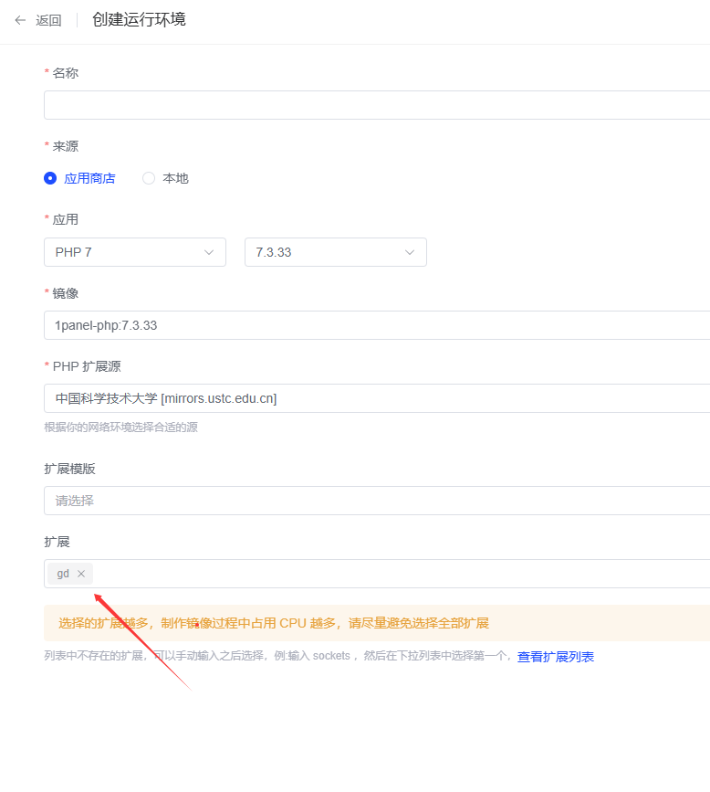
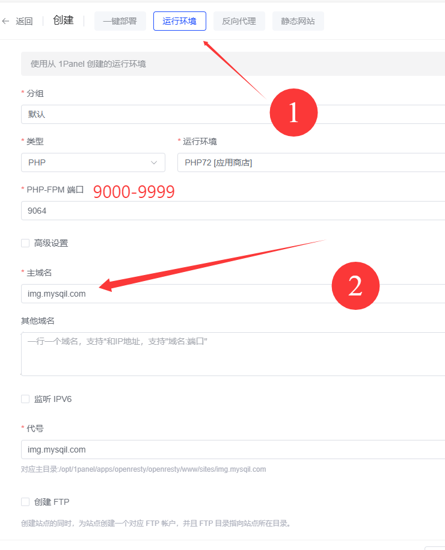
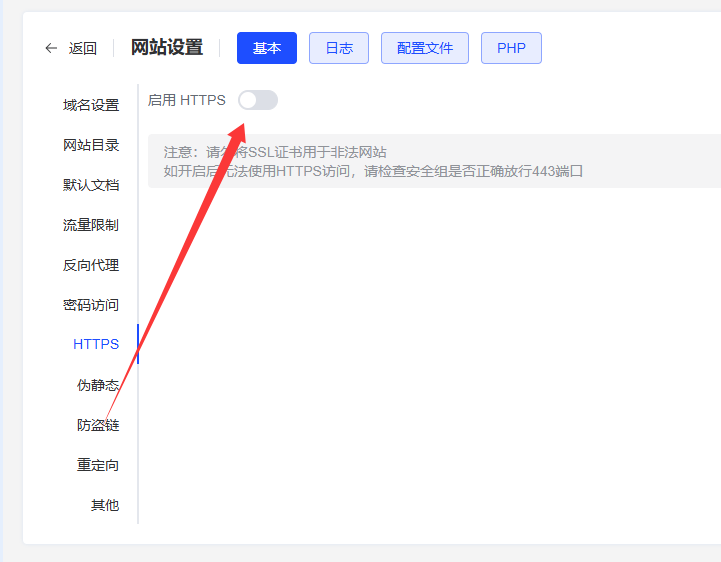
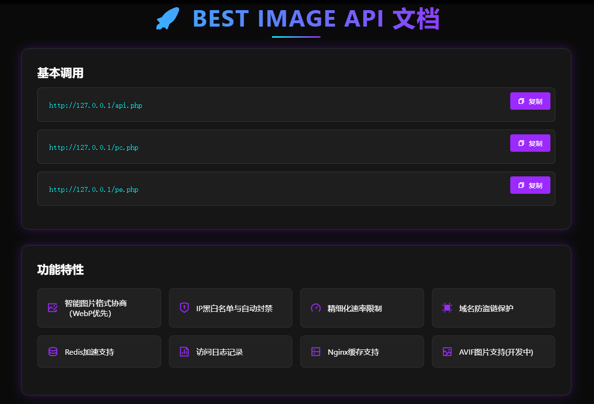
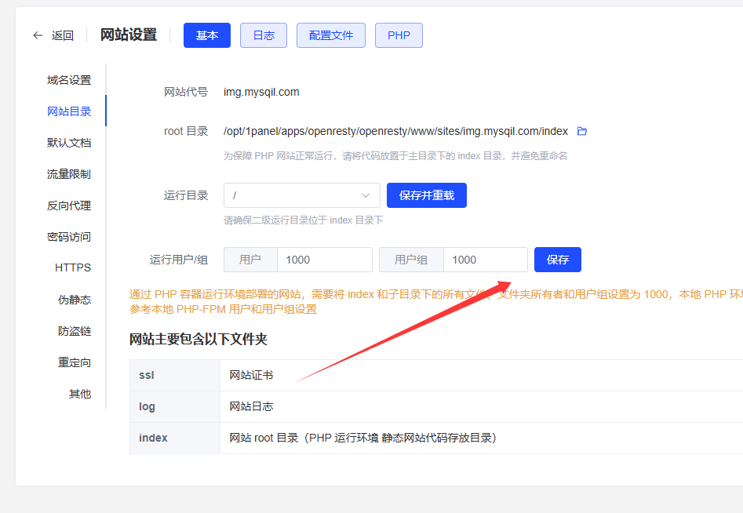

市面上很多图片API有的是获取文档的链接，也有的是遍历目录的图片，但是都没有一个统一的解决方案，所以我开发了一个随机图片API程序，有黑名单拦截等功能，可以防止暴力攻击接口！还有速率限制和管理后台！访问过多自动拉黑！

项目地址：[Best Image API: 高效的图片接口](https://gitee.com/matsuzakayuki/best-image-api)

现在我教大家怎么快速搭建这个项目，这里使用1Panel面板演示

# 1.创建php运行环境，扩展选择GD

# 2.创建网站

# 3.进入网站目录上传源码

可以配置一下SSL证书实现HTTPS访问

上传源码解压后访问网站首页

说明API已经配置好了，接下来访问/admin进入管理后台，默认密码123456

还有记得赋予权限！！！不然是无法生成配置的！

目前版本号：v1.5

- 😒前端使用Vue3重构
- 🥪优化后端逻辑
- 😶修复致命php注入漏洞
- 📸 随机获取手机电脑图片
- 📸 随机获取图片
- 🖼 智能图片格式协商（WebP优先）
- 🔒 IP黑白名单与自动封禁
- 🚦 精细化速率限制
- 🔗 域名防盗链保护
- ⚡ Redis加速支持
- 😉Nginx缓存支持
- 📊 访问日志记录
- 😊AVIF图片支持(开发中)

## 安全提示

- 🔑 后台默认密码: 123456 (可在配置文件中修改)

## 快速部署

### 环境要求

- PHP >= 7.3
- GD图像扩展

### 使用说明

- /admin目录为程序后台，可以进行各种设定！
- pc.txt/pe.txt分别存储图片外链，一行一条(也可以填写其他图片API做成混合接口模式)
- generate_images.php是一个基于GD扩展的图片处理文件，你可以访问他，输入密码后可以生成其他格式的文件，处理前请先打开文件配置目录，也可以设定密码！
- API支持本地图片和外链图片功能，可以在后台设定或者手动修改配置文件
- blacklist.txt和whitelist.txt分别是黑白名单配置文件，你可以用于限制ip访问，rate_limit.txt用于记录日志
- 请在images文件夹按照分类放置手机电脑图片
- 在配置文件可以设定防火墙和各种功能的开关，如果你不会配置可以使用后台来配置他