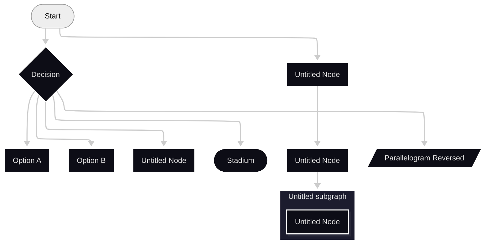
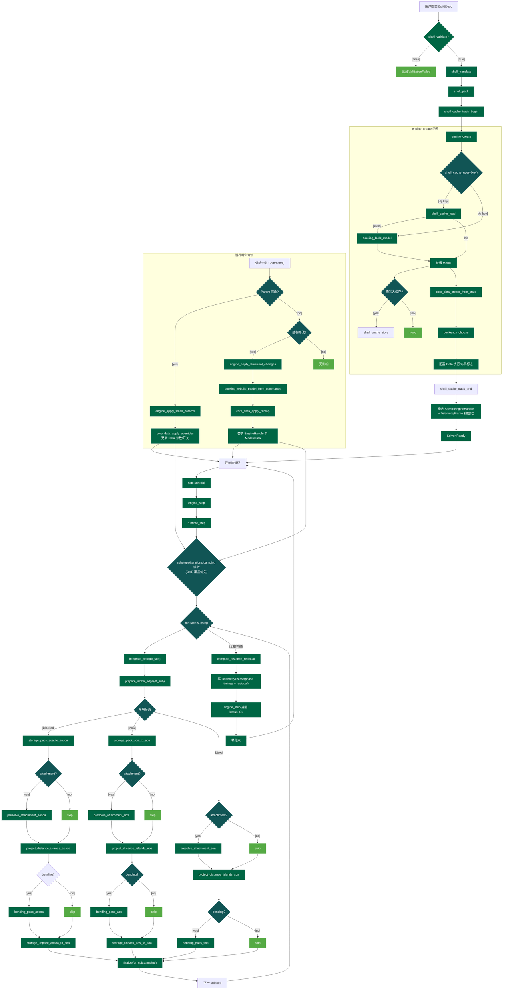
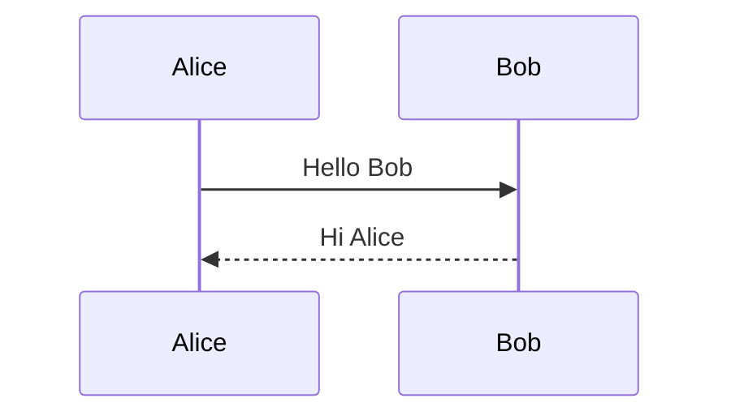
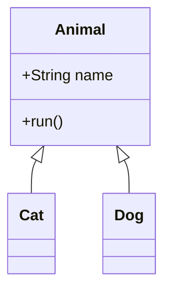
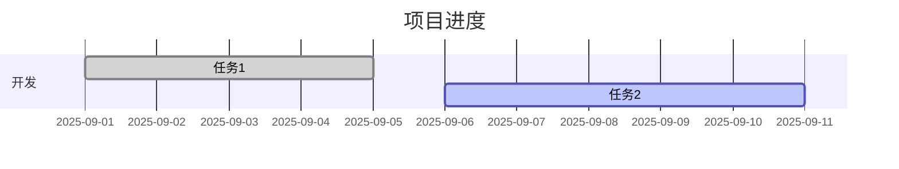
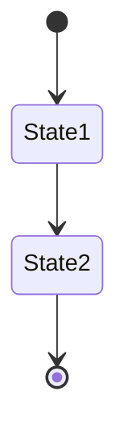
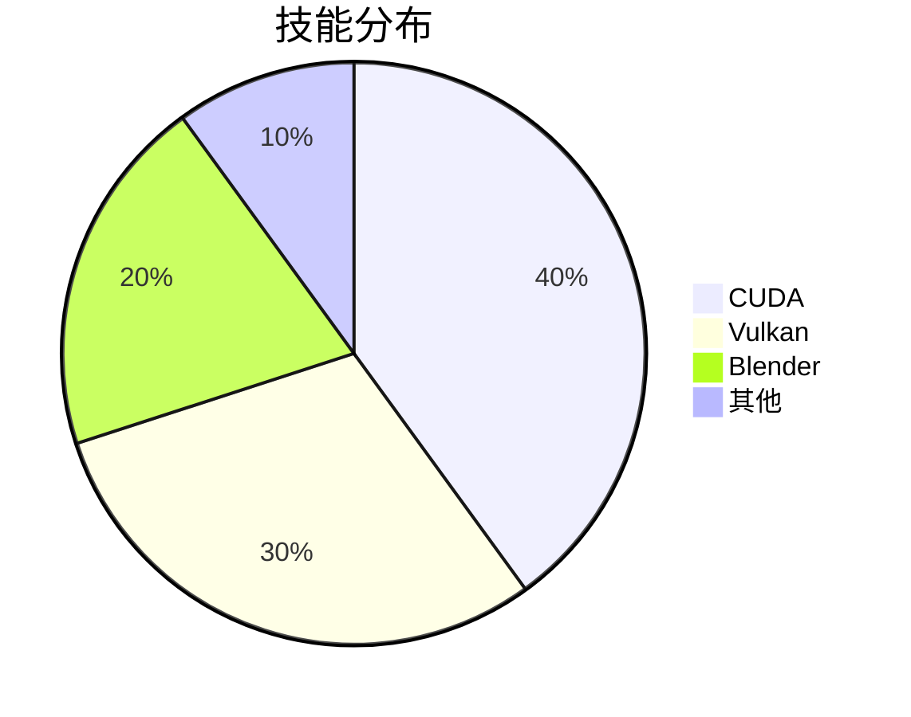
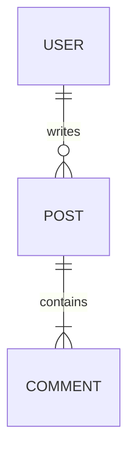

# 一级标题
## 二级标题
### 三级标题

**粗体** *斜体* ~~删除线~~ <u>下划线</u>  
行内代码：`console.log("hello")`

---

## 列表
- 无序 A
- 无序 B
    - 子项 1
    - 子项 2

1. 有序 1
2. 有序 2
3. 有序 3

- [x] 已完成
- [ ] 未完成

---

## 引用
> 这是一个引用块  
> 可以多行

---

## 分割线
---

## 表格

| 名称    | 星级 | 备注        |
|---------|------|-------------|
| Vulkan  | ★★★★☆ | GPU Compute |
| CUDA    | ★★★★★ | Kernels     |
| Blender | ★★★☆☆ | Extension   |

---

## 代码块

```js
function greet(name) {
  console.log(`Hello ${name}`);
}
greet("Mizuki");
```

```python
def add(a, b):
    return a+b
```

---

## 链接与图片
[外部链接](https://github.com/Xayah-Hina)  


---

## 提示框
:::info
这是一个 info 提示框
:::

:::tip
这是一个 tip 提示框
:::

:::warning
这是一个 warning 提示框
:::

:::danger
这是一个 danger 提示框
:::

---

## 数学公式

行内：$E = mc^2$

块级：

$$
\int_0^1 x^2 dx = \frac{1}{3}
$$

---

## Mermaid 图表

### 流程图




### 时序图


### 类图


### 甘特图


### 状态图


### 饼图


### ER 图


---

## 脚注
这是一个脚注引用[^1]。

[^1]: 这是脚注内容。

---

## Emoji
😄 🎉 🚀 ✨ :smile: :star:

---

## 视频与音频
<video controls width="400" src="/videos/demo.mp4"></video>  
<audio controls src="/audios/demo.mp3"></audio>

---

## 自定义组件
<Badge text="Beta" type="warning" />

---

## 目录
（此文档应自动生成 TOC，右侧显示）

---

结束测试 🎉
